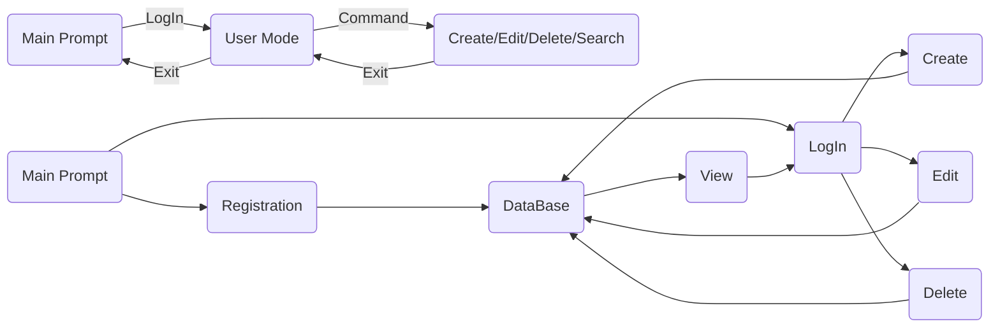

# Crowd Funding App

This is a simple crowd funding app in python. It is a practice project created as part of the python course provided by the Information Technology Institute (ITI).

## Features

- Interactive command prompt
- User login and registration
- Create, Edit and Delete projects in database
- View user profile and projects
- Search for projects and users

## Usage
```
> ./run.py 
   ______                       __   ______                ___            
  / ____/________ _      ______/ /  / ____/_  ______  ____/ (_)___  ____ _
 / /   / ___/ __ \ | /| / / __  /  / /_  / / / / __ \/ __  / / __ \/ __ `/
/ /___/ /  / /_/ / |/ |/ / /_/ /  / __/ / /_/ / / / / /_/ / / / / / /_/ / 
\____/_/   \____/|__/|__/\__,_/  /_/    \__,_/_/ /_/\__,_/_/_/ /_/\__, /  
                                                                 /____/   

Developed By: Mohand Zaid (muhanadaleem@gmail.com)

(h)help to show commands!

Crowd-Funding > 
```
## Code Flow


## Contributing
If you're a student or an aspiring coder, you are welcomed to contribute to my practice coding project. It's a great opportunity for practicing and honing your coding skills. Your contributions are highly appreciated and can have a positive impact on the project's growth.

## Contact

**Mohand Zaid**  ` < mohandzaid33@gmail.com > `
